# Database Schema & Entity-Relationship Diagram

> Companion to `DATABASE_DESIGN.md` (which covers design rationale, index strategy,
> sharding and scaling). **This document is the complete structural reference**:
> every collection, every field, and the full ER diagram with cardinalities.
> Generated from a code audit of `internal/models/models.go` + all
> `Collection("...")` call sites on 2026-08-01. 15 collections total.
>
> MongoDB has no foreign keys — every relationship below is a **reference enforced
> by application code** (noted per relationship). All money fields are **integer
> paise**. All `_id`s are app-generated UUID strings.

---

## 1. ER Diagram

```mermaid
erDiagram
    USERS ||--o| CARTS : "has (unique user_id)"
    USERS ||--o| WISHLISTS : "has (unique user_id)"
    USERS ||--o{ ORDERS : "places"
    USERS ||--o{ PAYMENTS : "makes"
    USERS ||--o{ REVIEWS : "writes"
    USERS ||--o{ RETURN_REQUESTS : "raises"
    OTPS }o..|| USERS : "logical link via phone"

    CATEGORIES ||--o{ CATEGORIES : "parent of (max 3 levels)"
    CATEGORIES ||--o{ PRODUCTS : "contains (by NAME, see quirks)"

    PRODUCTS ||--o{ REVIEWS : "receives"
    PRODUCTS ||--o{ CART_ITEMS : "referenced by"
    PRODUCTS ||--o{ ORDER_ITEMS : "snapshotted into"
    PRODUCTS ||--o{ RETURN_ITEMS : "referenced by"
    PRODUCTS ||--o{ WISHLIST_ITEMS : "referenced by"

    CARTS ||--|{ CART_ITEMS : "embeds"
    ORDERS ||--|{ ORDER_ITEMS : "embeds"
    WISHLISTS ||--o{ WISHLIST_ITEMS : "embeds"
    RETURN_REQUESTS ||--|{ RETURN_ITEMS : "embeds"
    USERS ||--o{ ADDRESSES : "embeds"
    ORDERS ||--|| ADDRESSES : "embeds shipping_address"
    SHIPMENTS ||--o{ TRACKING_EVENTS : "embeds"

    ORDERS ||--o{ PAYMENTS : "paid via"
    ORDERS ||--o| SHIPMENTS : "fulfilled by (1 per order, idempotent)"
    ORDERS ||--o| RETURN_REQUESTS : "max 1 OPEN per order"
    ORDERS }o..o| COUPONS : "applies (by code)"
    ORDERS }o..|| COUNTERS : "invoice seq per FY"

    ADMINS {
        string _id PK
        string email UK
        string password_hash "bcrypt"
    }
    CONTACT_MESSAGES {
        string _id PK
        string email
        string status "open|resolved"
    }

    USERS {
        string _id PK
        string phone UK "partial unique: only non-empty"
        string email
        string google_sub "Google account link"
        bool is_admin
    }
    OTPS {
        string _id PK
        string phone
        string code "always 123456 in mock mode"
        datetime expires_at "TTL auto-delete"
    }
    CATEGORIES {
        string _id PK
        string name
        string slug UK
        string parent_id FK "self-ref, empty=root"
        int level "1..3 enforced"
        string path "materialized ancestor path"
    }
    PRODUCTS {
        string _id PK
        string slug UK
        string category FK "category NAME (quirk)"
        int price "paise"
        int stock
        int advance_percent "nullable, default 20"
        int gst_percent "0=default 18"
        string hsn_code
    }
    CARTS {
        string _id PK
        string user_id FK,UK
    }
    ORDERS {
        string _id PK
        string user_id FK
        string order_number UK
        int total "paise"
        string payment_plan "full|partial"
        int advance_amount "paise, gateway charges this"
        int cod_amount "paise, courier collects"
        string status "pending..delivered|cancelled"
        string payment_status "pending|paid|refunded"
        string coupon_code FK "by code, optional"
        string shipment_id FK
        string invoice_number "INV-FY-seq, set once"
        datetime delivered_at "gates return window"
    }
    PAYMENTS {
        string _id PK
        string order_id FK
        string user_id FK
        string razorpay_order_id "gateway order/intent id (all gateways, see quirks)"
        int amount "paise = advance for partial plan"
        string status "created|paid|failed"
    }
    SHIPMENTS {
        string _id PK
        string order_id FK "1 per order"
        string provider "shipmozo"
        string awb "courier tracking number"
        string status "booked..delivered"
    }
    RETURN_REQUESTS {
        string _id PK
        string order_id FK
        string user_id FK
        string type "return|replacement"
        string status "requested|approved|rejected|completed"
    }
    REVIEWS {
        string _id PK
        string product_id FK
        string user_id FK
        string order_id FK "optional, drives is_verified"
        int rating "1..5"
        bool is_verified "verified purchase"
        bool is_approved "admin moderation"
    }
    COUPONS {
        string _id PK
        string code UK
        string type "percentage|fixed"
        int value
        int usage_limit
        int used_count
    }
    WISHLISTS {
        string _id PK
        string user_id FK,UK
    }
    COUNTERS {
        string _id PK "e.g. invoice_2627"
        int seq "atomic $inc"
    }
```

Legend: `||--o{` one-to-many · `||--o|` one-to-zero-or-one · `||--|{` one-to-one-or-more (embedded) · `}o..||` dotted = logical/by-value reference (no ID link). Embedded sub-documents (CART_ITEMS, ORDER_ITEMS, ADDRESSES, etc.) live **inside** their parent document — they are not separate collections.

---

## 2. Relationship & Cardinality Reference

| From | To | Cardinality | Reference field | Enforced by |
|---|---|---|---|---|
| users | carts | 1 → 0..1 | `carts.user_id` | unique index on `carts.user_id` |
| users | wishlists | 1 → 0..1 | `wishlists.user_id` | unique index |
| users | orders | 1 → 0..* | `orders.user_id` | app code (owner checks on every read) |
| users | payments | 1 → 0..* | `payments.user_id` | app code |
| users | reviews | 1 → 0..* | `reviews.user_id` | compound unique `(product_id, user_id)` = max 1 review per user per product |
| users | return_requests | 1 → 0..* | `return_requests.user_id` | app code |
| otps | users | logical | `otps.phone` = `users.phone` | by value; OTP rows TTL-deleted at `expires_at` |
| categories | categories | 1 → 0..* (self) | `categories.parent_id` | app code: max depth 3, cycle rejection, delete-with-children rejection |
| categories | products | 1 → 0..* | `products.category` = `categories.name` | **by NAME, not ID** — see quirks |
| products | reviews | 1 → 0..* | `reviews.product_id` | app code |
| orders | payments | 1 → 0..* | `payments.order_id` | app code; `markPaymentPaid` transitions order once (matched-count guard) |
| orders | shipments | 1 → 0..1 | `shipments.order_id` | app code: existing-shipment check → 409 (idempotent ship) |
| orders | return_requests | 1 → 0..1 *open* | `return_requests.order_id` | app code: one open request per order → 409; delivered-only; `RETURN_WINDOW_DAYS` |
| orders | coupons | 0..* → 0..1 | `orders.coupon_code` = `coupons.code` | by value; `used_count` incremented at checkout |
| orders | counters | * → 1 per FY | `orders.invoice_number` from `counters.seq` | atomic `findOneAndUpdate $inc` upsert; number written to order once (idempotent regeneration) |
| order_items | products | snapshot | `items[].product_id` + copied name/price/sku | **denormalized on purpose**: an order shows what the customer bought at that price, even if the product changes later |

---

## 3. Collections — Full Field Reference

### users
| Field | Type | Notes |
|---|---|---|
| `_id` | string | UUID |
| `phone` | string | login identity; **partial unique index** (`phone > ""`) — Google-only accounts have `""` and must not collide |
| `email`, `name`, `avatar` | string | from Google profile or user edit |
| `google_sub` | string | Google account subject; unique sparse index |
| `is_admin` | bool | legacy flag; real admin auth is the separate `admins` collection |
| `addresses` | []Address | embedded; `id, label, name, line1/2, city, state, pincode, country, phone, is_default` |
| `created_at`, `updated_at` | time | |

### otps
`_id`, `phone`, `code`, `expires_at` (**TTL index — Mongo auto-deletes**), `verified`, `created_at`. One active OTP per phone (previous deleted on send). Mock mode: code is always `123456`.

### admins
`_id`, `email` (unique), `name`, `password_hash` (bcrypt, never serialized to JSON), timestamps. Seeded from `ADMIN_EMAIL`/`ADMIN_PASSWORD` when the collection is empty.

### categories
| Field | Type | Notes |
|---|---|---|
| `_id`, `name`, `slug` | string | slug unique |
| `parent_id` | string | self-reference; empty = root |
| `level` | int | 1..3, **hard cap 3 enforced server-side** |
| `path` | string | materialized ancestor path `rootID/subID` — enables descendant-inclusive product filtering with one prefix query |
| `image`, `is_active`, `sort_order` | | display controls |

### products
| Field | Type | Notes |
|---|---|---|
| `_id`, `name`, `slug`, `description` | string | slug unique; weighted text index on name(10)/tags(5)/description(1) |
| `category` | string | **category name** (see quirks) |
| `price`, `compare_at_price` | int | paise; compare-at renders the strikethrough price |
| `images`, `thumbnail` | []string | S3/CDN URLs |
| `variants` | []Variant | embedded: `id, name, value, stock, price(override)` |
| `tags`, `is_active`, `sku`, `weight` | | soft-delete via `is_active` |
| `stock` | int | **the** stock source of truth (see quirks re: dead InventoryItem) |
| `advance_percent` | *int | nullable; nil → global default (20) |
| `gst_percent`, `hsn_code` | | invoice tax inputs; 0/empty → `DEFAULT_GST_PERCENT`/`DEFAULT_HSN_CODE` |

### carts
`_id`, `user_id` (unique — one cart per user), embedded `items[]`: `product_id, variant_id, name, price, quantity, image` (price refreshed against product at checkout).

### orders — the central document
| Field | Type | Notes |
|---|---|---|
| `_id`, `order_number` | string | order_number unique, human-facing `ORD-...` |
| `user_id` | string | owner |
| `items` | []OrderItem | embedded **price/name/sku snapshot** at purchase time |
| `subtotal`, `shipping_cost`, `discount`, `total` | int | paise |
| `payment_plan` | string | `full` \| `partial` |
| `advance_amount`, `cod_amount` | int | partial split: gateway charges advance, courier collects COD |
| `cod_collected` | bool | set by delivery webhook |
| `coupon_code` | string | by value |
| `status` | string | `pending → confirmed → processing → shipped → delivered` \| `cancelled` — transitions are guarded (e.g. ship only from confirmed/processing) |
| `payment_status` | string | `pending → paid → refunded` (single-transition guard) |
| `payment_method`, `payment_id` | string | gateway ref (`pi_...` for Stripe) |
| `shipping_address`, `billing_address` | Address | embedded copies |
| `tracking_id`, `tracking_url`, `shipment_id` | string | denormalized from shipment for cheap reads |
| `cancel_reason`, `cancelled_at` | | |
| `refund_id`, `refund_amount`, `refunded_at` | | refund capped at amount actually paid online |
| `delivered_at` | *time | set by delivery webhook; gates the return window |
| `invoice_number`, `invoice_date` | | assigned once from `counters`, immutable after |

### payments
`_id`, `order_id`, `user_id`, `razorpay_order_id` (gateway order/intent id — all gateways, see quirks), `razorpay_payment_id`, `razorpay_signature`, `amount` (= advance for partial plans), `currency`, `method`, `status` (`created|paid|failed`), timestamps. Multiple attempts per order allowed; order flips to paid exactly once.

### shipments
`_id`, `order_id` (one shipment per order — pre-insert existence check → 409), `provider` ("shipmozo"), `shipment_id` (provider's id), `awb`, `courier_name`, `tracking_url`, `label_url`, `status`, embedded `events[]` (`status, description, timestamp` — never null, normalizes to `[]`), `est_delivery`, parcel dims (`weight/length/width/height`), timestamps.

### return_requests
`_id`, `order_id`, `user_id`, embedded `items[]` (`product_id, qty, reason`), `type` (`return|replacement`), `status` (`requested|approved|rejected|completed`), `comment` (customer), `admin_note`, timestamps. Rules: order must be `delivered`, within `RETURN_WINDOW_DAYS` of `delivered_at`, one open request per order.

### reviews
`_id`, `product_id`, `user_id`, `user_name`, `user_phone`, `order_id` (optional — presence of a delivered order drives `is_verified`), `rating` (1–5), `title`, `comment`, `images[]`, `is_verified`, `is_approved` (admin moderation gate), timestamps. Unique `(product_id, user_id)`.

### coupons
`_id`, `code` (unique), `type` (`percentage|fixed`), `value`, `min_order`, `max_discount`, `usage_limit`, `used_count`, `is_active`, `description`, `expires_at`, timestamps.

### wishlists
`_id`, `user_id` (unique), embedded `items[]` (`product_id, added_at`).

### contact_messages
`_id`, `name`, `email`, `phone`, `subject`, `message`, `status` (`open|resolved`), `created_at`. Public writes are rate-limited (5/hour/IP via Redis).

### counters
`_id` (semantic key, e.g. `invoice_2627` = FY 2026-27), `seq` (int). Atomic `findOneAndUpdate {$inc} upsert` — collision-free invoice numbering even under concurrent requests.

---

## 4. Design Patterns in Use

- **Embed vs reference**: line items, addresses, variants, tracking events are *embedded* (always read with their parent, bounded size). Orders/payments/shipments/reviews are *referenced* (unbounded growth, independent lifecycle). This is textbook MongoDB modeling.
- **Snapshot denormalization**: `order.items[]` copies name/price/SKU at purchase; `order.tracking_id/url` copies from shipment. Orders remain historically accurate and list pages need no joins.
- **State machines with guarded transitions**: order `status` and `payment_status` transitions use conditional updates (`UpdateOne` with status filters), making replays/duplicates no-ops.
- **App-enforced integrity**: no FKs — every ownership check (`user_id` match), depth cap, and one-open-request rule lives in handler code and is unit/live tested.
- **All 40 indexes are code-managed** in `ensureIndexes()` (cmd/api/main.go) — a fresh database self-provisions on boot. Full index rationale lives in `DATABASE_DESIGN.md`.

## 5. Known Quirks (deliberate or legacy — documented so nobody "fixes" them blind)

1. **`products.category` stores the category NAME, not `_id`.** Renaming a category orphans its products unless products are updated in the same operation. Tree filtering resolves name → category → descendant paths. A future migration to ID-references is recommended before allowing category renames in admin.
2. **`payments.razorpay_*` field names are gateway-generic.** Legacy naming from the Razorpay era: for Stripe, `razorpay_order_id` holds the PaymentIntent id. Renaming would require a data migration; harmless as-is.
3. **`InventoryItem` struct is dead code.** It exists in `models.go` but no `inventory` collection is ever read or written — `products.stock` (+ per-variant stock) is the single source of truth, decremented transactionally at checkout. Safe to delete the struct.
4. **`users.is_admin` is vestigial.** Real admin auth uses the separate `admins` collection with bcrypt + `role=admin` JWTs. The flag remains on the user model but grants nothing on admin routes.
